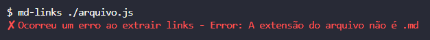

# Markdown Links

## Índice

* [1. Prefácio](#1-prefácio)
* [2. Resumo do projeto](#2-resumo-do-projeto)
* [3. Recursos Principais](#3-recursos-principais)
* [4. Guia Prático de Instalação e Uso](#4-guia-prático-de-instalação-e-uso)
* [5. Testes Unitários](#5-testes-unitários)
* [6. Critérios Minímos de Aceitação](#6-criterios-minimos-de-aceitação)
* [7. Especificações Técnicas](#7-especificações-técnicas)
* [8. Implementações futuras](#8-implementações-futuras)
* [9. Desenvolvedora](#9-desenvolvedora)

***

## 1. Prefácio

[Markdown](https://pt.wikipedia.org/wiki/Markdown) é uma linguagem de marcação amplamente adotada pela comunidade de programadores. Ela encontra aplicação em diversas plataformas de edição e formatação de texto, incluindo o GitHub, fóruns, e blogs. Arquivos formatados em `Markdown` são uma presença comum em qualquer repositório, sendo o `README.md` o exemplo mais representativo.

Esses documentos em `Markdown` costumam conter _links_ que podem estar quebrados, ou que já não são válidos, o que prejudica consideravelmente o valor da informação presente.

Este projeto foi desenvolvido como parte do bootcamp da Laboratória e consiste em um projeto de nível 4 de um catálogo de projetos de complexidade crescente, associados a objetivos de aprendizagem concretos. Portanto, Este projeto tem como objetivo desenvolver uma biblioteca JavaScript e uma ferramenta de linha de comando (CLI) para ler e analisar arquivos `Markdown`. Utilizando o ambiente [Node.js](https://nodejs.org/pt-br/), a biblioteca verificará os _links_  presentes nos arquivos `Markdown`, extraindo e validando esses _links_ fornecendo estatísticas relevantes.


## 2. Resumo do projeto

Md-links é uma biblioteca JavaScript que simplifica a extração de _links_ de arquivos `Markdown`, facilitando a validação de _links_ e fornecimento de estatísticas úteis. Ele é facilmente instalável via npm, tornando-se acessível aos desenvolvedores.

### Principais Características:

* Extração de Links: Md-links verifica eficientemente arquivos `Markdown` e extrai todos os _links_, economizando tempo em comparação com a extração manual.
* Validação de Links: Além da extração, valida os _links_ para garantir que estejam ativos.
* Estatísticas Detalhadas: Fornece estatísticas abrangentes sobre os _links_ encontrados nos arquivos.

### Desenvolvimento do Projeto:

Neste projeto, adquirimos conhecimentos essenciais em programação com [Node.js](https://nodejs.org/pt-br/), incluindo o entendimento de processos, interação com sistemas de arquivos, e a realização de consultas de rede. Também exploramos o potencial do [Node.js](https://nodejs.org/pt-br/) como ambiente de execução JavaScript e desenvolvemos habilidades em criar bibliotecas com uma ênfase na criação de interfaces de módulos eficazes e aderência a boas práticas de desenvolvimento.

#### Fluxograma

o fluxograma é uma ferramenta essencial que nos ajuda a planejar, acompanhar e alcançar os marcos do projeto de forma organizada e eficaz, tornando mais tangíveis os objetivos de aprendizagem estabelecidos. Dessa forma, o uso do fluxograma desempenhou um papel fundamental na estruturação e alcance dos objetivos de aprendizagem deste projeto. Ele atuou como um guia visual que nos ajudou a quebrar o projeto em pequenos passos, identificando as etapas principais do projeto. Com a ajuda do fluxograma, podemos visualizar a progressão e a conexão entre tarefas, tornando o processo de aprendizagem mais claro e gerenciável, refletindo as mudanças e ajustes necessários.

#### Fluxograma MD-Links

<div align="center">
 <br>
  Fluxograma MD-Links.
</div>


## 3. Recursos Principais

#### Leitura de Arquivos Markdown: 
* O programa recebe como entrada arquivos no formato `Markdown (.md)` a partir da linha de comando.

#### Extração de Links:
* Extrai todos os _links_ (URLs) presentes nos arquivos `Markdown` fornecidos como entrada.

#### Validação dos Links:
* Opção `--validate` que verifica o status HTTP de cada _link_ extraído e exibe o HTTP status code associado a cada um.

#### Estatísticas de Links:
* Opção `--stats` para fornecer estatísticas sobre os _links_ presentes nos arquivos, incluindo o total de _links_ e a contagem de _links_ únicos (sem duplicatas).

#### Combinação de Validação e Estatísticas:
* Opções `--validate` e `--stats` em conjunto, ao usar essa opção o programa gera estatísticas detalhadas, incluindo o número de _links_ quebrados, encontrados durante a validação, o total de _links_ e a contagem de _links_ únicos (sem duplicatas) dos dados estatísticos.

#### Mensagens de Erro:
* Implementação de mensagens de erro para lidar com os erros de entrada ou opções inválidas.


## 4. Guia Prático de Instalação e Uso

### 4.1. Instalação

Para instalação da biblioteca execute o seguinte comando através do terminal:

```
npm install md-links-jayanny-santana
```

### 4.2. Uso

A ferramenta MD-Links oference os seguintes recursos para arquivo `Markdown ('.md')`, e que podem ser executados a partir do terminal:

**Extração dos links**

Para leitura e extração dos _links_ de um arquivo `Markdown ('.md')`, execute o seguinte comando:

```
md-links <caminho-do-arquivo>
```
<p>
"/>
</p>

**Validação de links**

Para validar os _links_ de um arquivo `Markdown ('.md')`, execute o seguinte comando:

```
md-links <caminho-do-arquivo> --validate
```
<p>
 --validate">
</p>

**Estatísticas de links**

Para gerar dados estatísticos de um arquivo `Markdown ('.md')`, execute o seguinte comando:

```
md-links <caminho-do-arquivo> --stats
```
<p>
 --stats">
</p>

**Validação e Estatísticas de links**

Para validar os _links_ e gerar dados estatísticas de um arquivo `Markdown ('.md')`, execute o seguinte comando: 

```
md-links <caminho-do-arquivo> --validate --stats
```
<p>
 --validate --stats">
</p>

**Mensagens de erro**

A ferramenta é capaz de lidar com erros, por exemplo, mensagens de erro podem ser geradas em situações como estas:

* Quando a extensão do arquivo não for `Markdown ('.md')`
<p>

</p>

* Quando o arquivo `Markdown ('.md')` não puder ser lido:
<p>

</p>

* Quando o arquivo `Markdown ('.md')` estiver vazio e não possuir _links_ no seu conteúdo:
<p>

</p>

* Quando a validação dos _links_ do arquivo `Markdown ('.md')` falhar:
<p>

</p>

* Quando a estatística dos _links_ do arquivo `Markdown ('.md')` falhar:
<p>

</p>

* Quando a validação e estatística dos _links_ do arquivo `Markdown ('.md')` falhar:
<p>

</p>


## 5. Testes Unitários

Para este projeto foram desenvolvidos testes unitários utilizando a biblioteca de testes Jest. Dessa forma, os testes contemplaram as funções encarregadas ler, extrair, validar e gerar dados estatísticos dos _links_ em arquivos `Markdown ('.md')`, assim como tratar as opções dados referentes aos _links_.

Os testes unitários realizados obtiveram uma cobertura de 100% de statements (sentenças), functions (funções), lines (linhas), e branches (ramos) dos arquivos index.js e md-links.js.

<p>

</p>


## 6. Critérios Minímos de Aceitação

* [x] Poder instalar via `npm install`
* [x] Guia de uso e instalação da biblioteca
* [x] Implementa suporte para arquivo individual
* [x] Implementa `options.validate`
* [x] Possuir o executável `md-links` no path (configurado no `package.json`)
* [x] Implementar `--validate`
* [x] Implementar `--stats`
* [x] Implementar `--validate --stats`
* [x] Os testes unitários devem cobrir no mínimo 70% dos statements, functions,
  lines e branches
* [x] Rodar os testes e linter (`npm test`).


## 7. Especificações Técnicas

O projeto foi desenvolvido utilizando como ferramentas e tecnologias:

* JavaScript
* Node.js
* Npm.js
* Chalk
* Jest
* GitHub
* Git Bash
* Whimsical


## 8. Implementações futuras

* Implementar suporte para diretórios
* Poder adicionar uma propriedade line a cada objeto link indicando em que linha do arquivo está o link
* Poder agregar mais estatísticas
* Integração contínua com Travis ou Circle CI.

***

## 9. Desenvolvedora

Jayanny Santana
* GitHub: [@jay-santana](https://github.com/jay-santana)
* Linkedin: [Jayanny Santana](https://www.linkedin.com/in/jayanny-santana/)
